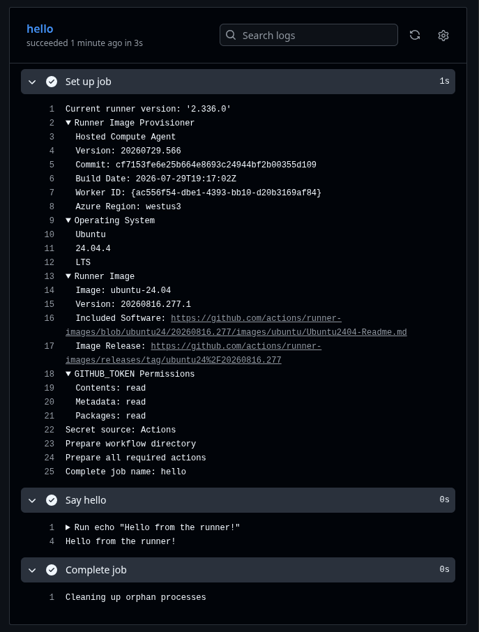

# CI/CD Frontend

This project aims to create a CI/CD pipeline step by step and document it:

## Summary

- [Workflow File](#workflow-file)
- [Steps: `run` vs `uses`](#steps-run-vs-uses)
- [Checkout, Setup, and Install](#checkout-setup-and-install)
- [Validation Order: Lint, Type Check, Build](#validation-order-lint-type-check-build)
- [Fail Fast](#fail-fast)

## Workflow File

Github actions is configured entirely through YAML files living in a specific folder: `.github/workflows/`

Any `.yml` file in there is a _workflow_. Github watches for events (like push) and, if a workflow says "I care about this event", it triggers.

A workflow needs three things a minimum:

1. name - just a label
2. on - the event that triggers it (e.g. push)
3. jobs - what to actually run, and where (which runner)

Ex:

```yml
name: CI

on: push

jobs:
  hello:
    runs-on: ubuntu-latest
    steps:
      - name: Say hello
        run: echo "Hello from the runner!"
```

Github actions:


## Steps: `run` vs `uses`

A step inside a job can be one of two kinds:

- **`run`**: executes a raw shell command directly on the runner, just like typing it into a terminal.

```yml
- name: Say hello
  run: echo "Hello from the runner!"
```

- **`uses`**: executes a pre-built, reusable **Action** published by someone else on GitHub, instead of a local file. `actions/checkout@v4`, for example, means "go to the GitHub repository at `github.com/actions/checkout`, get the code tagged `v4`, and run it as this step." GitHub downloads that repository's code and executes it inside the runner.

```yml
- name: Checkout repository
  uses: actions/checkout@v4
```

`actions` and `pnpm` are GitHub organizations/users that publish these actions (`actions` is maintained by GitHub itself, `pnpm` by the pnpm team). Anyone can publish an action — using one means trusting whoever owns that namespace.

## Checkout, Setup, and Install

A fresh runner starts as a blank virtual machine: it does **not** contain our repository files, nor tools like Node.js or pnpm by default. Three things need to happen before we can install dependencies:

1. **Checkout** — bring the repository's files into the runner (`actions/checkout@v4`).
2. **Setup tools** — install the exact Node.js and pnpm versions we want (`actions/setup-node@v4`, `pnpm/action-setup@v4`).
3. **Install dependencies** — now that both the files and the tools exist, run `pnpm install`.

Checkout and setup don't depend on each other and can happen in either order — what matters is that **both** happen before installing dependencies, since `pnpm install` needs the `package.json` (from checkout) and the `pnpm` binary (from setup).

```yml
name: CI

on: push

jobs:
  hello:
    runs-on: ubuntu-latest
    steps:
      - name: Checkout repository
        uses: actions/checkout@v4

      - name: Setup Node
        uses: actions/setup-node@v4
        with:
          node-version: 24

      - name: Setup pnpm
        uses: pnpm/action-setup@v4
        with:
          version: 11.10.0
```

## Validation Order: Lint, Type Check, Build

After installing dependencies, we validate the code before considering it "good." Order matters: run checks from **cheapest/fastest to most expensive**, so a broken commit fails as early as possible.

1. **Lint** (`pnpm lint`) — style/pattern checks, per-file, cheapest.
2. **Type check** (`pnpm tsc --noEmit`) — checks types across the whole project. More expensive than lint because types cross file boundaries (changing an exported interface can break a file you never touched).
3. **Build** (`pnpm build`) — most expensive. Bundling requires resolving the entire dependency graph into one self-consistent output, so it can never be scoped to "just the changed files."

This is also why **lint can safely be scoped to only touched files**, but **type check and build cannot** — they depend on the whole project, not isolated files.

```yml
- name: Install dependencies
  run: pnpm install

- name: Lint
  run: pnpm lint

- name: Type check
  run: pnpm tsc --noEmit

- name: Build
  run: pnpm build
```

## Fail Fast

Steps run sequentially. If any `run` step exits with a non-zero code, the job stops immediately — remaining steps are skipped and the job is marked failed. No extra config needed. This is why step order matters: cheapest checks first means broken code fails fast, saving runner time. Later, this is also what protects CD — a deploy step only runs if the validation steps before it succeeded.

## Caching Dependencies

Every CI run starts on a brand-new VM — no leftover files from previous runs. Without caching, `pnpm install` re-downloads every package from the registry on every single push, even if nothing changed.

Caching stores previously-downloaded packages, keyed by a hash of `pnpm-lock.yaml` (not `package.json`, since the lockfile pins exact versions, while `package.json` often has ranges like `^19.0.0`). If the lockfile hash matches a previous run, the cache is reused; if it changes, a fresh install happens and a new cache is saved.

`setup-node` supports this natively, but needs pnpm installed first (it calls `pnpm store path` internally) — so `setup pnpm` must now run **before** `setup Node`, unlike before.

```yml
- name: Setup pnpm
  uses: pnpm/action-setup@v4
  with:
    version: 11.10.0

- name: Setup Node
  uses: actions/setup-node@v4
  with:
    node-version: 24
    cache: "pnpm"
    cache-dependency-path: pnpm-lock.yaml
```

Verified: first run showed `downloaded 152, added 152` (21s total). Second run (no dependency changes) showed `reused 152, downloaded 0` (12s total) — proof the cache was used.
